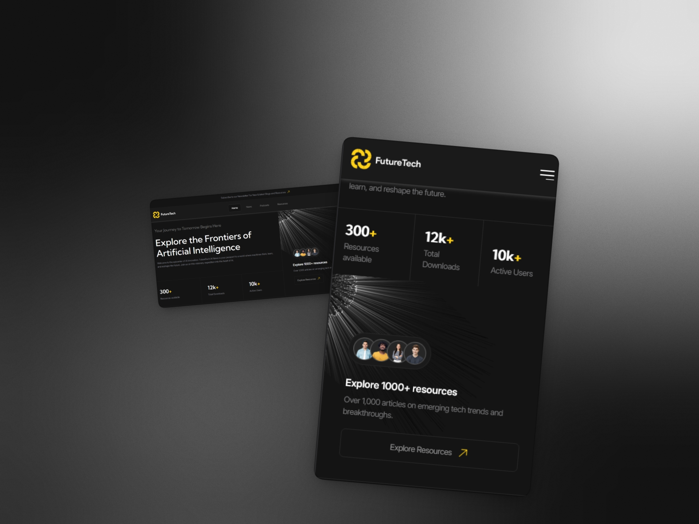

# Future Tech — Многостраничный адаптивный сайт

**Future Tech** — это высокотехнологичный многостраничный проект (6 страниц), посвященный теме искусственного интеллекта. Сайт разработан с акцентом на "чистый код", максимальную декомпозицию и создание универсальных переиспользуемых компонентов без применения сторонних фреймворков.

## 🛠 Технологический стек

- **HTML5**: Семантическая разметка, оптимизированная для скринридеров (Accessibility/A11y)
- **SCSS (Sass)**: Модульная структура с использованием директив `@use` и `@forward`, а также кастомных функций (`Fluid`, `rem`) для реализации "резиновой" адаптивности
- **JavaScript (Vanilla JS)**: Модульная архитектура на основе ES-классов

## 🚀 Ключевые технические особенности

### Реактивность через Proxy

Состояние интерфейса (например, в табах и селектах) управляется через паттерн **Proxy**. Это позволяет автоматически вызывать метод `updateUI()` и обновлять интерфейс при любом изменении данных в объекте состояния.

### Абстрактный базовый компонент

Все JavaScript-компоненты наследуются от абстрактного класса **BaseComponent**. Это унифицирует логику работы с состоянием (`GetProxyState`) и обязывает реализовывать метод перерисовки интерфейса.

### Кастомные UI-компоненты

- **Доступный селект**: Реализован с поддержкой управления с клавиатуры, использованием MatchMedia API для адаптивности (переключение между кастомным и нативным контролом) и полной синхронизацией с оригинальным элементом
- **Видеоплеер**: Кастомная панель управления на основе HTML5 Video API с автоматическим скрытием интерфейса при воспроизведении
- **Табы и Аккордеоны**: Табы поддерживают навигацию стрелками, клавишами Home/End и "зацикливание" перебора. Аккордеоны реализованы на чистом CSS с использованием тега `
`
- **Маски ввода**: Интеграция библиотеки **imask.js** для корректного форматирования номеров телефона в полях формы

### Продвинутый CSS

- Использование псевдокласса **`:has()`** для контекстной стилизации родительских элементов в зависимости от их содержимого (например, перестроение сетки карточек)
- Утилитарный класс **Full viewport width lines**: линии, выходящие за пределы контейнера и упирающиеся в края экрана, реализованные через `vw` и `calc`

## 📱 Адаптивность и UX

- ✅ **Полный адаптив**: Сайт корректно отображается на всех разрешениях от **1920px до 390px**
- 🎨 **Fluid Typography**: Плавное изменение размеров шрифтов и отступов с помощью функции `clamp()`
- 🌊 **Scroll Animation Timeline**: Современная CSS-анимация появления тени у хедера при скролле
- 📱 **UX-улучшения**: Предотвращение "залипания" hover-эффектов на тач-устройствах и увеличение кликабельных областей иконок до **44px**

---

🔗 **Live Demo**: [https://kuksikabi.github.io/Future-tech](https://kuksikabi.github.io/Future-tech)
